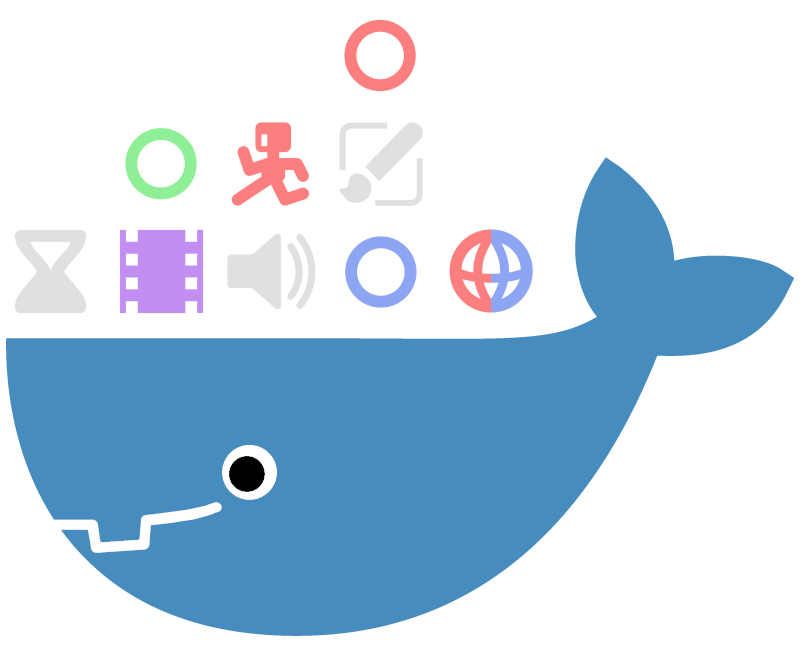

# Unofficial Godot Docker Image

<center></center>


This docker image is designed to build, test and export your games on a CI/CD pipeline. It
only contains the Godot engine with the tagged version.

## Links

* [Godot Engine](https://godotengine.org/)
* [Docker Hub](https://hub.docker.com/r/dunkelgrau/godot)
* [Github (Mirror)](https://github.com/graugraugrau/godot-dockerfile/)

## How to use

To test the image locally you can run:

```bash
docker container run dunkelgrau/godot:4.2.2 godot --version
```

The following minimal examples demonstrate how to setup a basic pipeline for different automation servers. The example imports all assets, export a windows build and archives the result.

The example assumes, that the Godot project file is on the root folder of your repository.

### Github

Add `.github/workflows/godot-ci.yml` to your repository with the following content:

```yml
name: Godot CI/CD

on:
  push:
    branches:
      - main

env:
  EXPORT_NAME: MyGodotGame

jobs:
  export_windows:
    runs-on: ubuntu-latest
    container: dunkelgrau/godot:4.2.2
    steps:
      - name: Create symbolic link for export templates
        run: ln -s /root/.local /github/home/.local
      - name: Check out repository
        uses: actions/checkout@v4
      - name: Import Godot project
        run: godot --headless --import
      - name: Create build folder
        run: mkdir -p build/windows
      - name: Export Windows executable
        run: godot --headless --export-release Windows\ Desktop build/windows/${EXPORT_NAME}.exe
      - name: Archive Windows executable
        uses: actions/upload-artifact@v4
        with:
          name: ${{ env.EXPORT_NAME }}
          path: build/windows
          if-no-files-found: error
```

### Gitlab

Add `.gitlab-ci.yml` to your repository with the following content:

```yml
image: dunkelgrau/godot:4.2.2

stages:
  - export

variables:
  EXPORT_NAME: MyGodotGame

export:
  stage: export
  only:
    - main
  script:
    - godot --headless --import
    - mkdir -p build/windows
    - godot --headless --export-release Windows\ Desktop build/windows/${EXPORT_NAME}.exe
  artifacts:
    name: $EXPORT_NAME
    paths:
      - build/windows
```

### Jenkins

Add `Jenkinsfile` to your repository with the following content:

```Groovy
pipeline {
    agent {
         docker { image 'dunkelgrau/godot:4.2.2' }
    }

    environment {
        EXPORT_NAME = 'MyGodotGame'
    }

    stages {
        stage('Export Windows') {
            steps {
                sh 'godot --headless --import'
                sh "mkdir -p build/windows"
                sh "godot --headless --export-release Windows\ Desktop build/windows/${EXPORT_NAME}.exe"
                sh "cd build/windows && zip -r ../../build/${EXPORT_NAME}.zip ./* && cd -"
                archiveArtifacts artifacts: "build/${EXPORT_NAME}.zip"
            }
        }
    }
}
```

## Extending the Docker Image

Use this docker image as base to deploy your game at [itch.io](https://itch.io). For example:
```dockerfile
FROM dunkelgrau/godot:4.2.2

RUN wget -O butler.zip https://broth.itch.ovh/butler/linux-amd64/LATEST/archive/default -q \
    && unzip butler.zip \
    && mv butler /usr/local/bin/butler \
    && chmod +x /usr/local/bin/butler \
    && rm butler.zip \
    && /usr/local/bin/butler -V
```

Extend the docker image with [gdtoolkit](https://github.com/Scony/godot-gdscript-toolkit) to also lint and format your godot files.
```dockerfile
FROM dunkelgrau/godot:4.2.2

RUN apt-get install -y --no-install-recommends pipx
RUN pipx install "gdtoolkit==4.*"
ENV PATH="$PATH:/root/.local/bin/"
```

# FAQ

**Q: How can I run the editor?**

**A:** The docker image is no replacement for the editor. In the docker container godot should always be executed with the argument `--headless`.

**Q: Is there a C#/Mono Version?**

**A:** Since I use mainly gdscript there is no C#/Mono version yet.

**Q: Why does Godot throw `Parse Error: Identifier "..." not declared in the current scope.` in my CI/CD pipeline?**

**A:** This typically happens if you are using a plugin, especially [GUT](https://github.com/bitwes/Gut). This PR should fix this issue: https://github.com/godotengine/godot/pull/92303